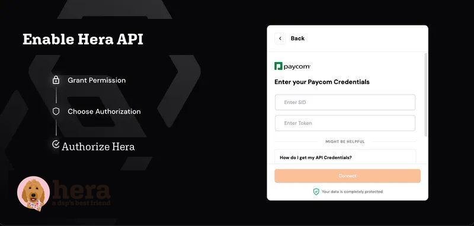
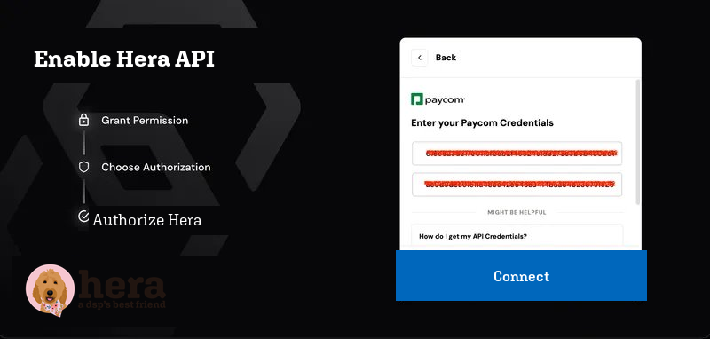

# How to Connect Paycom to Hera

**Type:** How-to
**Category:** Integrations
**Tags:** Paycom, Hera, HR integration, API, SID, token, Magic Link
**Audience:** Admins / Account owners
**Last updated:** 2026-05-06

---

## Overview

This guide walks you through connecting your Paycom account to Hera using a Magic Link. The connection gives Hera secure API access to your Paycom employee data. The process involves coordinating with your Paycom account representative and takes a few business days to get credentials in hand before you can complete the connection.

---

## Prerequisites

- An active Paycom account
- Access to your Paycom account representative
- Your Hera Magic Link (provided by Hera)

---

## Steps

### Step 1: Request API Access from Paycom

Contact your Paycom account representative and let them know you want to enable API integration. When they ask about your needs, tell them: *"I want a vendor to access my employee data from Paycom."*

Your Paycom rep will walk you through their standard approval process, which typically includes:

- Signing an NDA
- A discovery call with the Paycom automation team
- Reviewing and signing a proposal and MSA to add API access to your Paycom suite

> **Note:** This step is handled entirely with Paycom and may take several business days. You cannot proceed to the following steps until Paycom approves your API access.

For more detail on this process, refer to the [Paycom Client API Checklist](https://5243316.fs1.hubspotusercontent-na1.net/hubfs/5243316/Documentation%20Images/Paycom%20Client%20API%20Checklist.pdf).

---

### Step 2: Receive Your Paycom API Credentials

Once approved, Paycom will provide you with:

- **API SID** (System ID)
- **API Token**
- API Documentation

Keep these credentials in a secure location. You will need both to complete the connection in Step 4.

---

### Step 3: Allowlist Hera's IP Addresses in Paycom

Paycom restricts API access to specific, approved IP addresses. Before you can connect, you need to ask your Paycom representative to allowlist the following Hera IP addresses:

- `13.59.40.132`
- `3.136.219.255`
- `18.216.194.37`

Contact your Paycom rep directly and provide them this list. The connection will fail if this step is skipped.

---

### Step 4: Enter Your Credentials via the Hera Magic Link

Open the Hera Magic Link that was provided to you. On the connection screen:

1. Enter your **API SID** in the "Enter SID" field
2. Enter your **API Token** in the "Enter Token" field

Once both fields are filled in, the screen will look like this:

---

### Step 5: Complete the Connection

Click **Connect**.

If your credentials are correct and the IP addresses have been allowlisted, you will see a confirmation screen showing:

> "Connection established — Established secure connection"

Paycom is now connected to Hera.

---

## Common Issues

**The connection fails after clicking Connect.**
The most common cause is that Hera's IP addresses have not been allowlisted yet in Paycom. Confirm with your Paycom rep that all three IP addresses were added before retrying.

**I don't have a Magic Link.**
Reach out to Hera support to have a Magic Link sent to you.

**My credentials aren't working.**
Double-check that you're using the API SID and API Token from Paycom (not login credentials). If needed, ask your Paycom rep to reissue them.

---

## Related Articles

- How to connect Uzio to Hera (coming soon)

---

*For additional help, contact support.*
